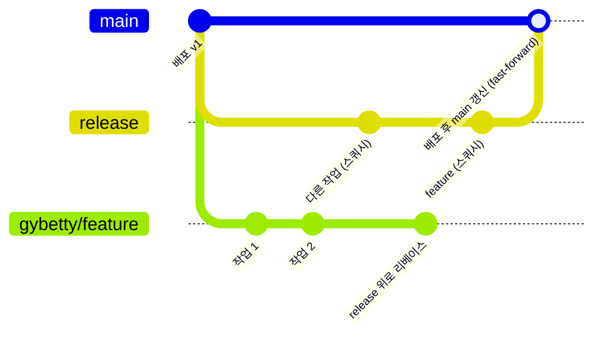

# 브랜치 전략

[문서 목차](README.md) · [배포](deploy.md) · [팀 운영](team/README.md)

사용자 결정 (2026-10-07). 사람과 에이전트(팀 역할, autofix 의 구베티·검투사·리플릿) 모두 이 규칙을 따른다. autofix 저장소와 같은 전략이다.

## 브랜치

| 브랜치 | 역할 | 누가 쓰나 |
|---|---|---|
| `main` | 운영 코드. `release` 를 따라간다. **Vercel 이 `main` 을 운영에 자동 배포한다** | 배포할 때만 갱신 |
| `release` | 다음 배포에 들어갈 코드. 작업 브랜치가 모이는 곳 | 스쿼시 머지로만 갱신 |
| 작업 브랜치 | 팀원 한 명의 작업 하나. `release` 에서 딴다 | 그 팀원만 커밋 |

작업 브랜치 이름: `<작업자>/<주제>`. 예) `gybetty/login-fix`, `senior/corrections-api`, `claude/branching`. 팀원끼리 같은 작업 브랜치에 커밋하지 않는다.

## 흐름



1. **분기**: `release` 최신에서 작업 브랜치를 딴다.
2. **작업**: 작업 브랜치에서 마음껏 커밋한다. 커밋은 나중에 하나로 합쳐진다.
3. **리베이스**: `release` 에 올리기 전에 작업 브랜치를 최신 `release` 위로 리베이스한다. 충돌은 작업 브랜치에서 푼다.
4. **스쿼시 머지**: 검토를 통과하면 작업 브랜치를 `release` 에 **스쿼시 머지**한다. `release` 에는 작업 하나가 커밋 하나로 남는다.
5. **배포 = main 갱신**: `release` 를 `main` 으로 fast-forward 한다. timesheet 는 `main` 이 바뀌면 Vercel 이 운영에 배포하므로 이 단계가 곧 배포다. `main` 에는 스쿼시하지 않는다. `main` 은 자기 커밋이 없으므로 `release` 와 같은 커밋 기록을 갖는다.
   - 배포 전 확인은 `release` 를 대상으로 연 PR 의 Vercel 미리보기에서 한다.
   - API(`timesheet-api`) 배포 절차는 [배포](deploy.md)를 따른다.

## 명령

```bash
# 1. 분기
git switch release && git pull --ff-only
git switch -c gybetty/<주제>

# 3. 리베이스
git fetch origin
git rebase origin/release

# 4. 스쿼시 머지 (release 에서)
git switch release && git pull --ff-only
git merge --squash gybetty/<주제>
git commit            # 메시지: 작업 하나를 한 줄로 요약, 본문에 무엇을·왜
git branch -D gybetty/<주제>

# 5. 배포 = main 갱신
git switch main && git pull --ff-only
git merge --ff-only release   # 실패하면 main 에 release 에 없는 커밋이 있다는 뜻 — 멈추고 원인을 본다
```

GitHub PR 로 할 때: 작업 브랜치 → `release` PR 은 **Squash and merge**, `release` → `main` 은 **Rebase and merge** (또는 로컬에서 위 fast-forward 후 푸시). `release` → `main` 머지가 운영 배포를 일으킨다.

## 규칙

- `main`·`release` 에 직접 커밋하지 않는다. `release` 는 스쿼시 머지 커밋만, `main` 은 `release` 에서 온 커밋만 갖는다.
- `main` 에 스쿼시 머지를 하지 않는다. 스쿼시하면 `main` 과 `release` 의 기록이 갈라져 다음 갱신이 fast-forward 되지 않는다.
- 작업 브랜치는 `release` 에서만 딴다. `main` 에서 따지 않는다.
- 공유된 `release`·`main` 은 리베이스·강제 푸시하지 않는다. 리베이스는 자기 작업 브랜치에서만 한다.
- 스쿼시 머지 전에 그 작업의 검토(검투사)와 테스트가 통과해야 한다.
- 에이전트는 머지·푸시를 하지 않는다. 머지는 컨트롤러가, 원격 푸시는 사용자가 승인한 뒤에 한다.

## 해석한 부분

요청 원문은 "리베이스 머지는 release 에 진행" 과 "release 에 머지는 스쿼시 머지" 를 함께 말한다. 이 문서는 이를 **작업 브랜치를 release 위로 리베이스한 뒤, release 에 스쿼시 머지** 로 읽었다. "main 은 배포된 release 를 리베이스 받는다" 는 **main 을 release 로 fast-forward** 하는 것으로 읽었다 (main 에 자기 커밋이 없으면 둘은 같다).
