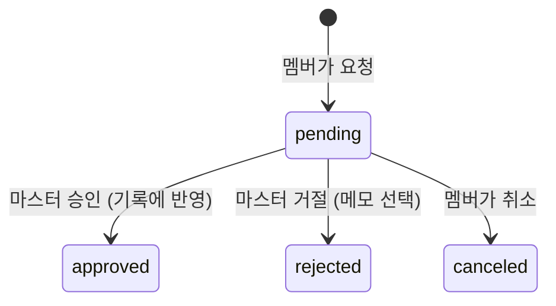

# 08. 기록 수정 요청과 승인

[← PRD 개요](README.md) · 근무 기록은 [01-attendance.md](01-attendance.md) · 권한은 [06-store-invite.md](06-store-invite.md)

## 목표

멤버는 자기 기록을 직접 고칠 수 없다([06](06-store-invite.md)). 대신 **수정을 요청**하고, 사장님(마스터)이 **승인하면 그때 기록이 바뀐다.**
잘못 찍은 출퇴근, 깜빡한 퇴근, 아예 빠진 기록을 모두 이 경로로 바로잡는다.

## 요청 종류

| 종류 | 언제 | 요청에 담는 것 | 승인하면 |
|---|---|---|---|
| 수정 `edit` | 출근·퇴근 시각이 틀렸다, 퇴근을 안 찍었다 | 대상 기록, 바른 출근·퇴근 시각, 사유 | 그 기록의 시각을 바꾼다 |
| 추가 `add` | 출퇴근을 아예 안 찍었다 | 출근·퇴근 시각, 사유 | 기록을 새로 만든다 |
| 삭제 `delete` | 실수로 찍은 기록 | 대상 기록, 사유 | 그 기록을 지운다 |

- 사유는 필수(1~200자). 시각은 퇴근 > 출근이어야 한다
- 한 기록에 대기 중인 요청은 하나뿐이다 (409 `REQUEST_PENDING`)

## 상태

- 승인·거절·취소된 요청은 다시 바뀌지 않는다 (409 `REQUEST_CLOSED`)
- 승인은 한 트랜잭션에서 요청 상태와 기록을 같이 바꾼다. 그 사이 대상 기록이 지워졌으면 404 `NOT_FOUND` 로 실패하고 요청은 대기로 남는다
- 승인해서 열린 기록이 둘이 되면(부분 유니크 인덱스) 409 `ALREADY_CLOCKED_IN`

## 화면

| 누가 | 어디 | 무엇 |
|---|---|---|
| 멤버 | 기록 탭 | 기록마다 "수정 요청"·"삭제 요청", 목록 위 "빠진 기록 추가 요청". 대기 중인 기록에 "요청 중" 표시 |
| 멤버 | 요청 탭 | 내 요청과 상태, 대기 중이면 취소 |
| 마스터 | 요청 탭 (하단 내비, 대기 건수 배지) | 대기 요청: 전·후 시각 비교, 사유, 승인·거절(메모) |
| 마스터 | 대시보드 "확인 필요" | 처리 대기 요청 N건 |

마스터는 지금처럼 기록을 직접 고칠 수도 있다([07](07-admin.md)). 요청은 멤버가 쓰는 경로다.

## API

| 메서드·경로 | 누가 | 설명 |
|---|---|---|
| `POST /api/corrections` | 소속 있음 | `{ action, shiftId?, start?, end?, reason }` |
| `POST /api/corrections/{id}/cancel` | 요청자 | 대기 중만 |
| `GET /api/requests/me` | 소속 있음 | 내 수정 요청·휴가·대타 전부 |
| `GET /api/stores/me/requests` | 마스터 | 매장의 요청 전부 (대기 먼저) |
| `POST /api/stores/me/corrections/{id}/approve` | 마스터 | 기록에 반영 |
| `POST /api/stores/me/corrections/{id}/reject` | 마스터 | `{ note? }` |

## 수용 기준

| ID | 기준 |
|---|---|
| C-1 | 멤버의 수정 요청을 마스터가 승인하면 기록 시각이 바뀌고 요청은 `approved` |
| C-2 | 추가 요청 승인 → 기록이 생긴다. 삭제 요청 승인 → 기록이 사라진다 |
| C-3 | 거절하면 기록은 그대로, 요청은 `rejected` 와 메모 |
| C-4 | 같은 기록에 두 번째 요청 → 409 `REQUEST_PENDING` |
| C-5 | 처리된 요청을 다시 승인·취소 → 409 `REQUEST_CLOSED` |
| C-6 | 다른 사람 기록에 요청 → 404. 멤버가 승인 API → 403 |
| C-7 | 퇴근이 출근보다 이르면 400 `VALIDATION_FAILED` |
