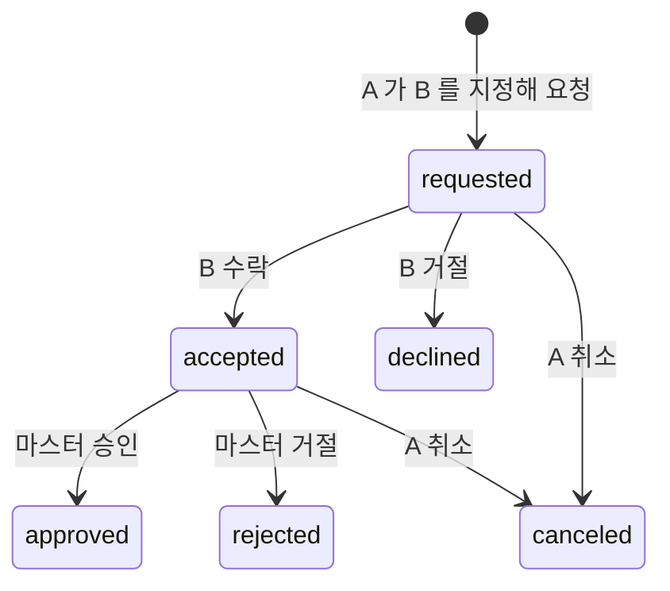

# 09. 휴가와 대타 근무

[← PRD 개요](README.md) · 급여 영향은 [02-pay.md](02-pay.md) · 요청 흐름은 [08-correction-requests.md](08-correction-requests.md)

## 목표

멤버가 휴가를 신청하고 대타를 부탁할 수 있다. **사장님(마스터)이 승인하거나 직접 등록·삭제해서 관리한다.**
승인된 휴가·대타는 급여 계산에 반영된다 — 결근으로 세지 않는다.

## 1. 휴가

| 항목 | 규칙 |
|---|---|
| 기간 | 시작일~종료일 (하루면 같은 날), 최대 30일 |
| 종류 | 유급 / 무급. **마스터가 승인할 때 정한다** — 멤버는 고르지 않는다 (2026-09-25 변경). 승인 전 응답의 `paid` 는 `null`(미정), 승인 API 는 `paid` 필수 |
| 흐름 | 멤버 신청 → `pending` → 마스터 승인 `approved` / 거절 `rejected`, 대기 중 멤버 취소 `canceled` |
| 직접 등록 | 마스터가 멤버를 골라 바로 `approved` 로 등록한다. 승인된 휴가를 마스터가 삭제할 수 있다 |
| 겹침 | 같은 멤버의 대기·승인 휴가와 날짜가 겹치면 409 `LEAVE_OVERLAP` |

## 2. 대타

A 가 그날 못 나오고 B 가 대신 나온다.

| 항목 | 규칙 |
|---|---|
| 대상 | 같은 매장 멤버, 자기 자신은 안 된다 |
| 날짜 | 하루 |
| 직접 등록 | 마스터가 A·B·날짜를 골라 바로 `approved` 로 등록, 삭제 가능 |

B 는 그날 평소처럼 출퇴근을 찍는다. 대타는 **기록을 옮기지 않는다** — A 의 결근 처리를 막고 누가 대신했는지 남기는 것이다.

## 3. 급여에 주는 영향

근거: 고용노동부 빠른인터넷상담 — "소정근로일 중의 지각, 조퇴, 휴일, 휴가, 휴업 등은 결근으로 처리할 수 없을 것입니다." / "휴일휴가로 인해 주소정근로일 전부를 출근하지 않은 경우에는 개근하지 않은 것으로 보아 유급주휴수당을 지급하지 않는다고 하더라도, 이를 법위반으로 보기 어려울 것" ([출처](https://www.moel.go.kr/minwon/fastcounsel/fastcounselView.do?inetDcssMngId=202403291031500211000))

| 승인된 것 | 그날 근무 기록이 없을 때 | 급여 |
|---|---|---|
| 유급 휴가 | 결근 아님 | **휴가수당** = 1일 소정근로시간 × 시급 |
| 무급 휴가 | 결근 아님 | 0원 |
| 대타 (A 쪽) | 결근 아님 | 0원 (근무 날짜를 바꾼 것으로 본다) |
| 대타 (B 쪽) | — | 찍은 기록대로. 소정을 넘으면 [연장근로](03-overtime.md) |

**주휴 개근 판정** (02 의 판정을 바꾼다): `근무한 날 수 ≥ 1` **그리고** `근무한 날 수 + 결근 아닌 날 수 ≥ 1주 소정근로일수`.
그 주를 전부 휴가로 쉬면(근무 0일) 주휴는 0원이다 — 위 해석의 두 번째 문장.

### 알려진 단순화

- 연차 잔여일을 세지 않는다. 유급으로 줄지는 마스터가 정한다 (단시간근로자 연차는 소정근로시간 비례 — 앱이 계산하지 않는다)
- 휴가수당의 "1일 소정근로시간" 은 1주 소정근로시간 ÷ 1주 소정근로일수다
- 소정근로일이 아닌 날(원래 쉬는 날)에 휴가를 넣어도 앱은 구분하지 못하고 결근 아님으로 센다

## 4. 화면

| 누가 | 어디 | 무엇 |
|---|---|---|
| 멤버 | 요청 탭 | 휴가 신청(기간·사유), 대타 요청(날짜·동료·사유), 받은 대타 요청 수락·거절, 내 요청 취소 |
| 멤버 | 급여 탭 | 주별 내역에 휴가수당, 결근 아닌 날 수 |
| 마스터 | 요청 탭 | 대기 휴가 승인(유급 여부를 여기서 정함)·거절, 수락된 대타 승인·거절, **휴가·대타 직접 등록**, 예정된 휴가·대타 목록과 삭제 |
| 마스터 | 멤버 상세 | 기록 목록에 휴가·대타 날짜 표시, 급여에 휴가수당 |

## 5. API

| 메서드·경로 | 누가 | 설명 |
|---|---|---|
| `POST /api/leaves` | 소속 있음 | `{ startDate, endDate, reason }` |
| `POST /api/leaves/{id}/cancel` | 신청자 | 대기 중만 |
| `POST /api/substitutions` | 소속 있음 | `{ date, substituteId, reason }` |
| `POST /api/substitutions/{id}/accept` · `/decline` | 지정된 대타 | `requested` 일 때만 |
| `POST /api/substitutions/{id}/cancel` | 요청자 | `requested`·`accepted` 일 때만 |
| `GET /api/stores/me/colleagues` | 소속 있음 | 대타로 고를 동료 (이름·id) |
| `GET /api/absences/me?from&to` | 소속 있음 | 내 결근 아닌 날 (급여 계산용) |
| `POST /api/stores/me/leaves` | 마스터 | 직접 등록 `{ userId, startDate, endDate, paid, reason }` |
| `POST /api/stores/me/leaves/{id}/approve` | 마스터 | `{ paid, note? }` — `paid` 필수 |
| `POST /api/stores/me/leaves/{id}/reject` | 마스터 | `{ note? }` |
| `DELETE /api/stores/me/leaves/{id}` | 마스터 | 승인된 휴가 삭제 |
| `POST /api/stores/me/substitutions` | 마스터 | 직접 등록 `{ requesterId, substituteId, date, reason }` |
| `POST /api/stores/me/substitutions/{id}/approve` · `/reject` | 마스터 | `accepted` 일 때만 |
| `DELETE /api/stores/me/substitutions/{id}` | 마스터 | 승인된 대타 삭제 |

대시보드·멤버 상세 응답에 그 기간의 `absences` 가 같이 온다.

## 6. 수용 기준

| ID | 기준 |
|---|---|
| L-1 | 주 20시간·5일 계약, 4일 근무 + 유급 휴가 1일 → 주휴 41,280 + 휴가수당 41,280 (시급 10,320) |
| L-2 | 같은 조건, 무급 휴가 1일 → 주휴 41,280, 휴가수당 0 |
| L-3 | 5일 전부 휴가 → 주휴 0 |
| L-4 | 휴가 날 근무 기록도 있으면 그날은 근무로 세고 휴가수당은 없다 |
| S-1 | A→B 대타 요청, B 수락, 마스터 승인 → A 의 그날은 결근 아님 (L-2 와 같은 급여) |
| S-2 | B 가 수락하기 전 마스터 승인 → 409 `REQUEST_CLOSED` 가 아니라 409 `SUBSTITUTE_NOT_ACCEPTED` |
| S-3 | 자기 자신·다른 매장 멤버를 대타로 지정 → 400·404 |
| M-1 | 마스터가 직접 등록한 휴가·대타는 바로 `approved`, 삭제하면 급여에서 빠진다 |
| M-2 | 겹치는 휴가 → 409 `LEAVE_OVERLAP` |
| M-3 | 멤버 신청 응답의 `paid` 는 `null`, `paid` 없이 승인 → 400 `VALIDATION_FAILED` |
